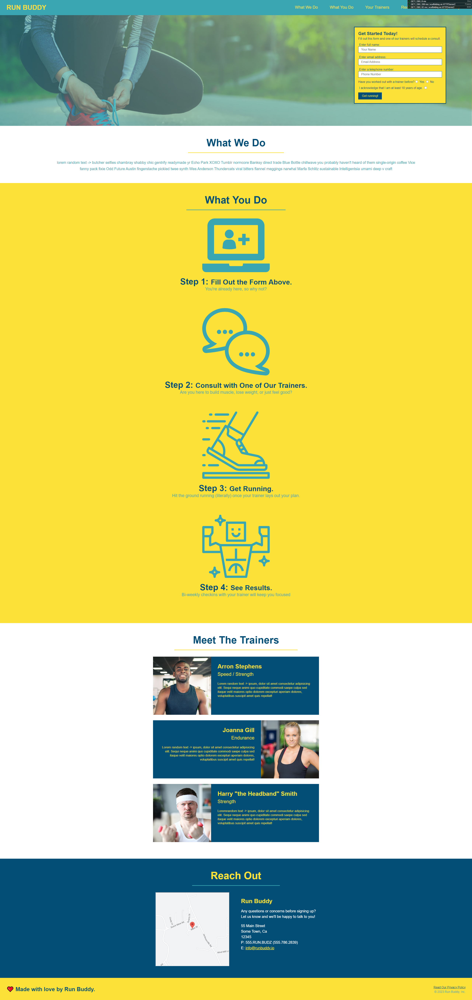
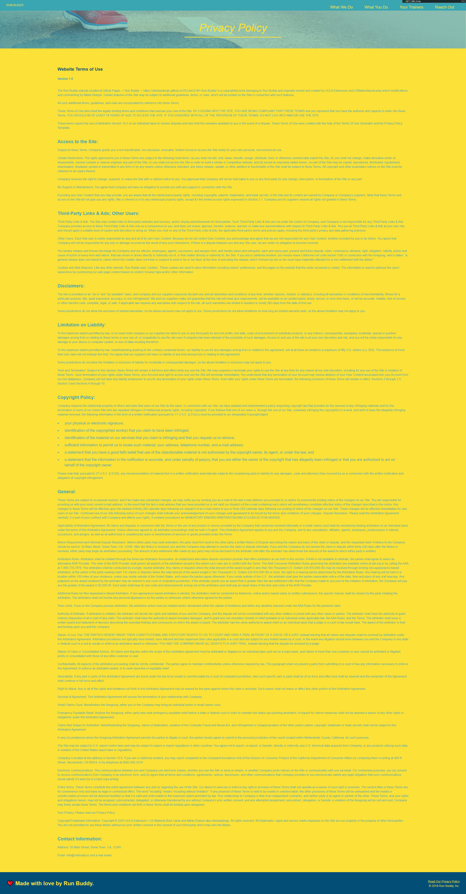

# Project Name: Run Buddy v2

> - A website service that lets runners sign up for personal training.
> - Live Website Hosted by GitHub Pages.

## Project Original Creators:

> - UCLA Extension
> - U2 BootCamp Network
> - edX Boot Camps LLC

## Project Recreated with additional notes and comments by:

> - Nikita "Nik" Sharpio aka Niksharpkings

---

## Module 1: HTML, CSS, and Git

---

###### Development For:

UCLA Extension's & U2 Network Boot Camp's
Full-Stack Web Development Coding Boot Camp 2021-2022

### Project Description:

###### *Fictional Story:*

- Run Buddy is a company that matches runners with personal trainers.
- I was tasked to create a landing page for the website as a freelancer that was hired by a friend at Run Buddy.
- A website service that lets runners sign up for personal training.
- Create a landing page is to attact more sign-ups as a new hired Full-Stack Developer that will hand off this site to internal developers to complete the data collection.
- Set up a basic structured semantic HTML & CSS document.
- The Run Buddy website is a huge success so far!
- With the landing page bringing in more business, the company now has the capital and incentive to upgrade the site.
- So this week we'll focus on building Run Buddy 2.0, which will make the site mobile-friendly and easier to use.
- In doing so, we'll intergrade more depth powerful layout capabilities of CSS, including media queries and flexbox.
- Building a foundational knowledge of HTML, CSS, and Git involves a steep learning curve. Learning a myriad of concepts and complex, intertwined tools all at once.

---

### GitHub Information:

#### Live Deployed Website Link:

[Hosted by GitHub Pages- https://niksharpkings.github.io/UCLAxU2-M1-Run-Buddy/](https://niksharpkings.github.io/UCLAxU2-M1-Run-Buddy/)

#### GitHub Repository Link:

[GitHub Repo - https://github.com/Niksharpkings/UCLAxU2-M1-Run-Buddy](https://github.com/Niksharpkings/UCLAxU2-M1-Run-Buddy)

---

### Development Information:

#### Coding Language Used:

1) `HTML5 [(Vanilla)/(default)] `
2) `CSS3`

#### Program/Software Used:

1) [VScode - https://code.visualstudio.com/](https://code.visualstudio.com/)
2) [VScode Extensions: open in browser](https://marketplace.visualstudio.com/items?itemName=techer.open-in-browser)
3) [GitBash - https://gitforwindows.org/](https://gitforwindows.org/)
4) [GitHub - https://github.com/](https://github.com/)

##### Version:

`v2.0.2 - | Section 2.2 thru 2.5 Complete | Updated/Changed Class-Notes, CSS flexbox improvements, CSS Global Componites, Revamped the CSS to be mobile responsive|`

`v2.0.1 - | Section 2.1 Complete | Updated Class-Notes |`

`v2.0.0 - | Repo Created | Added Files: index.html, README.md, LICENSE, .gitignore and all Files from Run Buddy V1 |`

---

#### ScreenShot of Deployed Website:

###### Home page - index.html ScreenShot:

###### Privacy & Policy page - privacy-policy.html ScreenShot:

---

###### Licence, Privacy & Policy Note:

This repoitory and contents was originally created and designed by UCLA Extension + U2 Network Boot Camp for the Full-Stack Web Development Coding Boot Camp 2021-2023 as a step by step tutorial guide/module that was required to be recreated/replicated/reproduced by me, Nikita "Nik" Sharpio aka account named "niksharpkings", and other students alike. I am not the true claiming owner/designer/creater/developer of this project or files excluding the README.md, .gitignore, LICENSE, Class-Notes.md and some of the original content was modifed with my own personal comments and additional tunes. I do not intend or plan to claim any ownership or rights of the original content of this github repository, but I was & am endorsed, ratified, recommend, adviced, & allowed to publish this dittoed repository by the school program from scratch as reference proof or enrollment & a profile model, guidance, pointer, reference, or example.  Any modifications I made to the original files will be in the root directory, otherwise all "original content" will be stored in "UCLAxU2-Original-SnapShot" folder.
